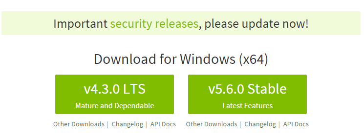
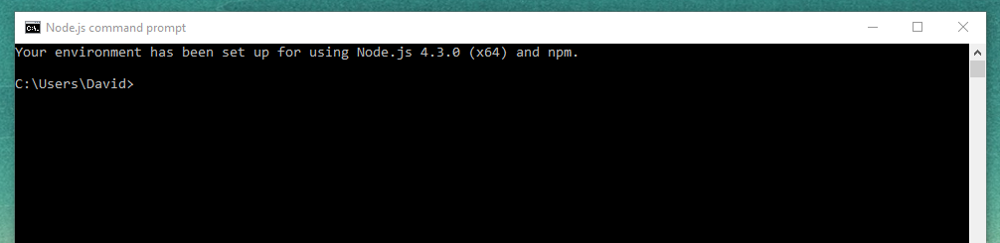

Tutorial de instalación de NodeJS, Express, GitHub, Cloud9, Atom y Markdown en Windows.
=================================================================================
Author: Ángel David Martín Rodríguez

Correo: alu0100818208@ull.edu.es

================================================================================

## Instalación de NodeJS

Éste intérprete de **Javascript** hace uso de un modelo de **programación dirigida por eventos** y de **E/S sin bloqueo**
lo que lo convierte en una herramienta ligera y eficiente. Además, el paquete **npm** es el mayor ecosistema de librerias
open source en el mundo.

Su instalación en windows es bastante sencilla. Lo primero es descargarnos el instalador en nuestro ordenador:



Luego seguimos los pasos del instalador hasta que haya terminado. Una vez finalizada la instalación guardamos ejecutamos el
**Node.js command prompt** y nos debe salir algo como esto:



## Instalación de Express

Según sus creadores, express es una infraestructura de aplicaciones web Node.js mínima y flexible que proporciona un conjunto
sólido de características para las aplicaciones web y móviles.

Para instalarla haremos uso de **Node.js command prompt**, donde escribiremos el siguiente comando:

> `npm install express --save`

Tras lo cual nos debería salir lo siguiente por la consola:


## Instalación de GitHub Desktop

**GitHub** proporciona una herramienta en forma de aplicación que permite una organización cómoda de nuestros repositorios.
Para instalarla nos descargamos el .exe de la página web:


Una vez finalizada la instalación debemos iniciar sesión y ya tendremos todo listo para empezar a trabajar en el escritorio:


## Cloud9

Esta herramienta no es sino un IDE para el desarrollo de código en la nube. Debemos crearnos una cuenta en la misma para
empezar a trabajar en ella.


## Atom

Es un editor de textos intuitivo y bastante facil de usar. Al igual que cualquier otra aplicación nos descargamos
el instalador y seguimos los pasos.


Una vez instalado, podemos usarlo para editar el código de nuestros repositorios de GitHub Desktop.


## Pandoc

Pandoc es una herramienta que nos permite convertir entre tipos de archivo como pueden ser markdown o html.

El primer paso es descargarla de la página de GitHub de los desarrolladores y seguir los pasos del instalador.


Lo siguiente es verificar que se ha instalando correctamente introduciendo el **comando**:

> `pandoc --version`

Por último, tenemos que ir al archivo donde tenemos nuestro fichero a convertir y lo convertimos. En éste caso en específico, pasamos de un markdown a html con el siguiente comando:

> `pandoc index.md -f markdown -t html -s -o index.html`

## Markdown

Es un lenguaje de marcado ligero, que trata de conseguir la máxima legibilidad y facilidad de publicación tanto en su
forma de entrada como de salida.

**Sintaxis:**

Encabezados
```
# Tipo H1
## Tipo H2
### Tipo H3
```
Tipografía
```
**Negrita**
*Cursiva*
> Citas
`Codigo`
```
Recursos
```

* [Links](https://example.com)
```
Listas
```
1. Lista 1
2. Lista 2

* Lista 1
* Lista 2
```

**Enlaces de Interes:**

* [NodeJS](https://nodejs.org)
* [Express](http://expressjs.com)
* [Atom IDE](https://atom.io)
* [GitHub Desktop](https://desktop.github.com)
* [GitHub Pages](https://pages.github.com/)
* [Cloud 9 IDE](https://c9.io)
